<p align="center">
  
</p>

<h1 align="center">Prompt Runner SDK</h1>

<p align="center">
  <strong>A comprehensive Elixir toolkit for orchestrating multi-step prompt executions with Claude Agent SDK and Codex SDK</strong>
</p>

<p align="center">
  <a href="https://hex.pm/packages/prompt_runner_sdk"></a>
  <a href="https://hexdocs.pm/prompt_runner_sdk"></a>
  <a href="https://github.com/nshkrdotcom/prompt_runner_sdk/actions"></a>
  <a href="LICENSE"></a>
</p>

---

## Overview

**Prompt Runner SDK** is a powerful Elixir-based command-line tool and library for managing and executing sequences of AI prompts across multiple LLM backends. Whether you're building complex multi-step code generation pipelines, automating development workflows, or orchestrating AI-assisted refactoring tasks, Prompt Runner SDK provides the infrastructure to run prompts reliably with real-time streaming output and persistent progress tracking.

### Why Prompt Runner SDK?

- **Multi-LLM Support**: Seamlessly switch between Claude Agent SDK and Codex SDK, even within the same prompt sequence
- **Real-time Streaming**: Watch AI responses stream in real-time with rich terminal formatting
- **Progress Persistence**: Resume interrupted sessions exactly where you left off
- **Multi-Repository**: Execute prompts that span multiple git repositories with coordinated commits
- **Production Ready**: Comprehensive logging, validation, and error handling for production use

## Features

### 🚀 Dual LLM Backend Support

Prompt Runner SDK provides a unified facade for both **Claude Agent SDK** (Anthropic) and **Codex SDK** (OpenAI), allowing you to:

- Configure a default LLM backend at the project level
- Override the LLM on a per-prompt basis
- Mix and match Claude and Codex within the same execution run

```elixir
%{
  llm: %{
    sdk: "claude_agent_sdk",
    model: "sonnet",
    prompt_overrides: %{
      "02" => %{sdk: "codex_sdk", model: "gpt-5.1-codex"}
    }
  }
}
```

### 📡 Real-time Streaming Output

Experience AI responses as they're generated with our advanced streaming renderer:

- **Compact Mode**: Token-based display showing messages, tools, and thinking indicators
- **Verbose Mode**: Full event details for debugging and analysis
- **Color-coded Output**: Instantly distinguish between roles, tools, and status
- **Event Logging**: Capture all events in JSON format for post-processing

### 📊 Persistent Progress Tracking

Never lose your place in a long-running prompt sequence:

- Tracks completion status for each prompt
- Supports `--continue` to resume from the last successful prompt
- Handles partial successes when working with multiple repositories
- Status markers: `[ ]` pending, `[/]` in-progress, `[x]` completed, `[!]` failed

### 🔀 Multi-Repository Support

Execute prompts that affect multiple codebases simultaneously:

```elixir
%{
  target_repos: [
    %{name: "frontend", path: "/path/to/frontend", default: true},
    %{name: "backend", path: "/path/to/backend"},
    %{name: "shared", path: "/path/to/shared-lib"}
  ]
}
```

Each prompt can specify which repositories it should modify, with automatic git commit coordination.

### 📝 Automatic Git Integration

Streamline your development workflow with built-in git operations:

- Pre-configured commit messages for each prompt
- Support for multi-repo commits with repo-specific messages
- Automatic staging and committing after successful prompt execution
- `--no-commit` option for dry runs and testing

### 🎯 Phase-Based Organization

Organize complex prompt sequences into logical phases:

```
# prompts.txt (Format: NUM|PHASE|SP|NAME|FILE[|TARGET_REPOS])
01|1|5|Schema Design|001-schema.md
02|1|8|Database Setup|002-database.md
03|2|13|API Layer|003-api.md|backend
04|2|8|Frontend Components|004-components.md|frontend,shared
05|3|21|Integration Tests|005-tests.md|backend,frontend
```

Run entire phases with `--phase N` or continue from a specific point with `--continue`.

## Installation

Add `prompt_runner_sdk` to your list of dependencies in `mix.exs`:

```elixir
def deps do
  [
    {:prompt_runner_sdk, "~> 0.1.0"}
  ]
end
```

Then run:

```bash
mix deps.get
```

## Quick Start

### 1. Create a Configuration File

Create `runner_config.exs` in your project:

```elixir
%{
  project_dir: "/path/to/your/project",
  
  llm: %{
    sdk: "claude_agent_sdk",
    model: "sonnet",
    permission_mode: :accept_edits,
    allowed_tools: ["Read", "Write", "Bash"]
  },
  
  prompts_file: "prompts.txt",
  commit_messages_file: "commit-messages.txt",
  progress_file: ".progress",
  log_dir: "logs",
  
  phase_names: %{
    1 => "Foundation",
    2 => "Core Features",
    3 => "Integration"
  }
}
```

### 2. Define Your Prompts

Create `prompts.txt`:

```
01|1|5|Initial Setup|001-setup.md
02|1|8|Core Module|002-core.md
03|2|13|Feature Implementation|003-feature.md
```

### 3. Create Commit Messages

Create `commit-messages.txt`:

```
=== COMMIT 01 ===
feat(init): set up project structure and dependencies

=== COMMIT 02 ===
feat(core): implement core module with basic functionality

=== COMMIT 03 ===
feat(feature): add main feature implementation
```

### 4. Write Your Prompts

Create individual prompt files (e.g., `001-setup.md`, `002-core.md`, etc.) with your AI instructions.

### 5. Run!

```bash
# List all prompts with their status
mix run run_prompts.exs --config runner_config.exs --list

# Preview what would execute (dry-run)
mix run run_prompts.exs --config runner_config.exs --dry-run 01

# Execute a single prompt
mix run run_prompts.exs --config runner_config.exs --run 01

# Execute all prompts in a phase
mix run run_prompts.exs --config runner_config.exs --run --phase 1

# Execute all prompts
mix run run_prompts.exs --config runner_config.exs --run --all

# Continue from where you left off
mix run run_prompts.exs --config runner_config.exs --run --continue
```

## CLI Reference

### Commands

| Command | Description |
|---------|-------------|
| `--list` | Display all prompts with their current status |
| `--validate` | Run comprehensive configuration validation |
| `--dry-run TARGET` | Preview execution without running |
| `--plan-only` | Generate execution plan only |
| `--run TARGET` | Execute prompts with streaming output |

### Targets

| Target | Description |
|--------|-------------|
| `NN` | Single prompt by number (e.g., `01`, `15`) |
| `--phase N` | All prompts in phase N |
| `--all` | All prompts in sequence |
| `--continue` | Resume from last completed prompt |
| `--partial-continue` | Resume failed repos from partial success |

### Options

| Option | Description |
|--------|-------------|
| `--config FILE` | Configuration file path (required) |
| `--no-commit` | Skip git commits after prompts |
| `--project-dir DIR` | Override project directory |
| `--repo-override N:P` | Override repo path by name |
| `--log-mode MODE` | Output mode: `compact` or `verbose` |
| `--log-meta MODE` | Event metadata: `none` or `full` |
| `--events-mode MODE` | Events log: `compact`, `full`, or `off` |
| `--branch-strategy MODE` | Branch mode: `direct`, `feature_branch`, `per_prompt` |
| `--branch-name NAME` | Override branch name |
| `--auto-pr` | Create PRs after completion |

## Configuration Reference

### Full Configuration Example

```elixir
%{
  # Project settings
  project_dir: "/path/to/project",
  
  # Multi-repo configuration
  target_repos: [
    %{name: "main", path: "/path/to/main", default: true},
    %{name: "lib", path: "/path/to/lib"}
  ],
  
  # LLM configuration
  llm: %{
    sdk: "claude_agent_sdk",        # or "codex_sdk"
    model: "sonnet",               # model identifier
    permission_mode: :accept_edits, # :plan, :accept_edits, :bypass_permissions
    allowed_tools: ["Read", "Write", "Bash", "Computer"],
    
    # Claude-specific options
    claude_opts: %{},
    
    # Codex-specific options
    codex_opts: %{},
    codex_thread_opts: %{
      sandbox: :workspace_write,
      ask_for_approval: :never
    },
    
    # Per-prompt overrides
    prompt_overrides: %{
      "05" => %{sdk: "codex_sdk", model: "gpt-5.1-codex"},
      "10" => %{model: "opus", permission_mode: :plan}
    }
  },
  
  # File paths
  prompts_file: "prompts.txt",
  commit_messages_file: "commit-messages.txt",
  progress_file: ".progress",
  log_dir: "logs",
  
  # Display settings
  log_mode: :compact,              # :compact or :verbose
  log_meta: :none,                 # :none or :full
  events_mode: :compact,           # :compact, :full, or :off
  
  # Organization
  phase_names: %{
    1 => "Setup & Configuration",
    2 => "Core Implementation",
    3 => "Testing & Integration",
    4 => "Documentation",
    5 => "Release Preparation"
  }
}
```

## Architecture

```
┌─────────────────────────────────────────────────────────────────┐
│                         CLI Interface                           │
│                    (PromptRunner.CLI)                           │
└─────────────────────────────────────────────────────────────────┘
                              │
                              ▼
┌─────────────────────────────────────────────────────────────────┐
│                    Configuration Layer                          │
│  ┌──────────────┐  ┌──────────────┐  ┌──────────────────────┐   │
│  │    Config    │  │   Prompts    │  │  CommitMessages      │   │
│  │   Loader     │  │    Parser    │  │     Parser           │   │
│  └──────────────┘  └──────────────┘  └──────────────────────┘   │
└─────────────────────────────────────────────────────────────────┘
                              │
                              ▼
┌─────────────────────────────────────────────────────────────────┐
│                      Execution Engine                           │
│  ┌──────────────┐  ┌──────────────┐  ┌──────────────────────┐   │
│  │    Runner    │  │   Progress   │  │     Validator        │   │
│  │              │  │   Tracker    │  │                      │   │
│  └──────────────┘  └──────────────┘  └──────────────────────┘   │
└─────────────────────────────────────────────────────────────────┘
                              │
                              ▼
┌─────────────────────────────────────────────────────────────────┐
│                       LLM Facade                                │
│  ┌────────────────────────┐  ┌────────────────────────────────┐ │
│  │    Claude Agent SDK    │  │        Codex SDK               │ │
│  │    (Anthropic)         │  │        (OpenAI)                │ │
│  └────────────────────────┘  └────────────────────────────────┘ │
└─────────────────────────────────────────────────────────────────┘
                              │
                              ▼
┌─────────────────────────────────────────────────────────────────┐
│                     Output & Integration                        │
│  ┌──────────────┐  ┌──────────────┐  ┌──────────────────────┐   │
│  │   Stream     │  │     Git      │  │       UI             │   │
│  │   Renderer   │  │  Integration │  │    Utilities         │   │
│  └──────────────┘  └──────────────┘  └──────────────────────┘   │
└─────────────────────────────────────────────────────────────────┘
```

## Examples

The `examples/simple` directory contains a complete two-prompt demonstration:

```bash
# Navigate to the examples directory
cd examples/simple

# View the configuration
cat runner_config.exs

# List prompts
mix run ../../run_prompts.exs --config runner_config.exs --list

# Run the first prompt (uses Claude)
mix run ../../run_prompts.exs --config runner_config.exs --run 01

# Run the second prompt (uses Codex override)
mix run ../../run_prompts.exs --config runner_config.exs --run 02
```

The `examples/multi_repo_dummy` directory demonstrates a single prompt that targets
two dummy repos and commits to each repo separately:

```bash
# Create dummy repos
cd examples/multi_repo_dummy
bash setup.sh

# Run the multi-repo prompt
mix run ../../run_prompts.exs --config runner_config.exs --run 01

# Clean up
bash cleanup.sh
```

## Stream Renderer Output

### Compact Mode Legend

```
legend: m:s=system m:u=user m:a=assistant th:=thinking t+=tool_start t-=tool_end
```

- `m:s` - System message
- `m:u` - User message  
- `m:a` - Assistant message
- `th:` - Thinking/reasoning
- `t+name` - Tool use started
- `t-name` - Tool use completed
- `✓` - Success indicator
- `!` - Error indicator

### Verbose Mode

Provides full event details including:
- Complete tool input/output
- Token counts and timing
- Metadata and debugging information

## Development

```bash
# Clone the repository
git clone https://github.com/nshkrdotcom/prompt_runner_sdk.git
cd prompt_runner_sdk

# Install dependencies
mix deps.get

# Run tests
mix test

# Run Credo
mix credo --strict

# Run Dialyzer
mix dialyzer

# Generate documentation
mix docs
```

## Contributing

Contributions are welcome! Please feel free to submit a Pull Request. For major changes, please open an issue first to discuss what you would like to change.

1. Fork the repository
2. Create your feature branch (`git checkout -b feature/amazing-feature`)
3. Commit your changes (`git commit -m 'feat: add amazing feature'`)
4. Push to the branch (`git push origin feature/amazing-feature`)
5. Open a Pull Request

## License

This project is licensed under the MIT License - see the [LICENSE](LICENSE) file for details.

## Acknowledgments

- [Claude Agent SDK](https://hex.pm/packages/claude_agent_sdk) - Anthropic's Claude integration for Elixir
- [Codex SDK](https://hex.pm/packages/codex_sdk) - OpenAI's Codex integration for Elixir
- The Elixir community for their excellent tooling and ecosystem

---

<p align="center">
  Made with 💜 by <a href="https://github.com/nshkrdotcom">nshkrdotcom</a>
</p>
