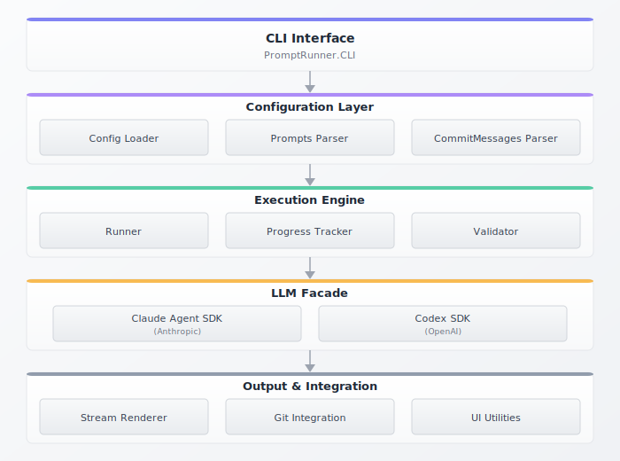

<p align="center">
  
</p>

<h1 align="center">Prompt Runner SDK</h1>

<p align="center">
  <strong>Run ordered prompt sequences with streaming output, automatic git commits, and dual LLM support</strong>
</p>

<p align="center">
  <a href="https://hex.pm/packages/prompt_runner_sdk"></a>
  <a href="https://hexdocs.pm/prompt_runner_sdk"></a>
  <a href="LICENSE"></a>
</p>

---

## What It Does

Prompt Runner SDK executes a sequence of LLM prompts against your codebase, with:

- **Streaming output** - See responses as they're generated
- **Automatic git commits** - Each prompt gets its own commit
- **Dual LLM support** - Claude Agent SDK and Codex SDK through one interface
- **Progress tracking** - Resume interrupted runs with `--continue`

## Two Use Cases

### Use Case 1: Single Repository (Most Common)

You have one codebase. Prompts run against it. Commits go to it.

```elixir
# runner_config.exs
%{
  project_dir: "/path/to/your/project",
  prompts_file: "prompts.txt",
  commit_messages_file: "commit-messages.txt",
  progress_file: ".progress",
  log_dir: "logs",
  model: "sonnet",
  llm: %{sdk: "claude_agent_sdk"}
}
```

```
# prompts.txt
01|1|5|Setup database|001-setup.md
02|1|8|Add API layer|002-api.md
```

```
# commit-messages.txt
=== COMMIT 01 ===
feat: setup database schema

=== COMMIT 02 ===
feat: add API layer
```

Run it:
```bash
mix run run_prompts.exs -c runner_config.exs --run 01
mix run run_prompts.exs -c runner_config.exs --run 02
```

**Example:** `examples/simple/`

### Use Case 2: Multiple Repositories

You have multiple codebases. Each prompt specifies which repos it modifies.

```elixir
# runner_config.exs
%{
  project_dir: "/path/to/workspace",  # LLM working directory
  target_repos: [
    %{name: "frontend", path: "/path/to/frontend", default: true},
    %{name: "backend", path: "/path/to/backend"}
  ],
  prompts_file: "prompts.txt",
  commit_messages_file: "commit-messages.txt",
  progress_file: ".progress",
  log_dir: "logs",
  model: "sonnet",
  llm: %{sdk: "claude_agent_sdk"}
}
```

```
# prompts.txt (add TARGET_REPOS column)
01|1|5|Setup both|001-setup.md|frontend,backend
02|1|8|Frontend only|002-frontend.md|frontend
03|1|8|Backend only|003-backend.md|backend
```

```
# commit-messages.txt (use repo-specific markers)
=== COMMIT 01:frontend ===
feat(frontend): initial setup

=== COMMIT 01:backend ===
feat(backend): initial setup

=== COMMIT 02:frontend ===
feat(frontend): add components

=== COMMIT 03:backend ===
feat(backend): add API routes
```

**Example:** `examples/multi_repo_dummy/`

## Quick Start

```bash
# Clone and setup
git clone https://github.com/nshkrdotcom/prompt_runner_sdk.git
cd prompt_runner_sdk
mix deps.get

# Run the multi-repo example (recommended starting point)
bash examples/multi_repo_dummy/setup.sh
mix run run_prompts.exs -c examples/multi_repo_dummy/runner_config.exs --list
mix run run_prompts.exs -c examples/multi_repo_dummy/runner_config.exs --run 01
```

## Installation

```elixir
def deps do
  [{:prompt_runner_sdk, "~> 0.1.1"}]
end
```

## CLI Commands

```bash
# List prompts and their status
mix run run_prompts.exs -c config.exs --list

# Preview what would run (no execution)
mix run run_prompts.exs -c config.exs --dry-run 01

# Run a single prompt
mix run run_prompts.exs -c config.exs --run 01

# Run all prompts
mix run run_prompts.exs -c config.exs --run --all

# Resume from last completed
mix run run_prompts.exs -c config.exs --run --continue

# Run without committing
mix run run_prompts.exs -c config.exs --run 01 --no-commit
```

## Dual LLM Support

Switch between Claude and Codex per-prompt:

```elixir
%{
  llm: %{
    sdk: "claude_agent_sdk",  # default
    model: "sonnet",
    prompt_overrides: %{
      "03" => %{sdk: "codex_sdk", model: "gpt-5.1-codex"}
    }
  }
}
```

## File Format Reference

### prompts.txt

Format: `NUM|PHASE|SP|NAME|FILE[|TARGET_REPOS]`

| Field | Description |
|-------|-------------|
| NUM | Prompt number (01, 02, ...) |
| PHASE | Phase grouping (1-5) |
| SP | Story points (for tracking) |
| NAME | Display name |
| FILE | Markdown file with prompt content |
| TARGET_REPOS | Optional: comma-separated repo names |

### commit-messages.txt

Single repo: `=== COMMIT NN ===`
Multi repo: `=== COMMIT NN:repo_name ===`

### runner_config.exs

```elixir
%{
  # Required
  project_dir: "/path/to/project",
  prompts_file: "prompts.txt",
  commit_messages_file: "commit-messages.txt",
  progress_file: ".progress",
  log_dir: "logs",
  model: "sonnet",

  # Optional: multi-repo support
  target_repos: [
    %{name: "app", path: "/path/to/app", default: true},
    %{name: "lib", path: "/path/to/lib"}
  ],

  # Optional: LLM configuration
  llm: %{
    sdk: "claude_agent_sdk",
    model: "sonnet",
    permission_mode: :accept_edits,
    allowed_tools: ["Read", "Write", "Bash"],
    prompt_overrides: %{}
  },

  # Optional: display
  log_mode: :compact,
  phase_names: %{1 => "Setup", 2 => "Implementation"}
}
```

## Architecture

<p align="center">
  
</p>

## Examples

| Example | Description |
|---------|-------------|
| `examples/simple/` | Single repo, dual LLM (Claude + Codex) |
| `examples/multi_repo_dummy/` | Multiple repos, per-repo commits |

## Development

```bash
mix test          # Run tests
mix credo --strict # Lint
mix dialyzer       # Type check
mix docs           # Generate docs
```

## License

MIT - see [LICENSE](LICENSE)

---

<p align="center">
  Made with 💚 by <a href="https://github.com/nshkrdotcom">nshkrdotcom</a>
</p>
