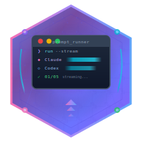

<p align="center">
  
</p>

<h1 align="center">Prompt Runner SDK</h1>

<p align="center">
  <strong>Packet-first prompt execution for Elixir, Mix, and local CLI workflows</strong>
</p>

<p align="center">
  <a href="https://hex.pm/packages/prompt_runner_sdk"></a>
  <a href="https://hexdocs.pm/prompt_runner_sdk"></a>
  <a href="LICENSE"></a>
</p>

Prompt Runner SDK executes packetized prompt workflows against local
repositories. This README targets `prompt_runner_sdk ~> 0.7.0`.

`0.7.0` is a breaking redesign:

- packets replace duplicated control files
- profiles replace ad hoc global defaults
- completion is verifier-owned, not provider-owned
- policy-driven retry, repair, and resume are built into the runtime
- a built-in simulated provider can prove recovery behavior without any
  external provider CLI

The same runtime is exposed through public Elixir modules and the CLI.

## Highlights

- one packet manifest: `prompt_runner_packet.md`
- one prompt format: `*.prompt.md` with YAML front matter
- template-based prompt scaffolding with home-scoped and packet-local templates
- home-scoped profiles under `~/.config/prompt_runner/`
- deterministic completion contracts plus generated checklist views
- policy-driven retry, repair, and resume based on verifier state plus
  structured recovery envelopes
- zero-dependency simulation for retry, repair, and resume demos
- public packet/profile/runtime APIs plus matching CLI commands
- Claude, Codex, Gemini, and Amp support through `agent_session_manager`
- no direct provider SDK dependencies required in host applications

## Installation

```elixir
def deps do
  [
    {:prompt_runner_sdk, "~> 0.7.0"}
  ]
end
```

```bash
mix deps.get
```

Prompt Runner is an explicit `agent_session_manager` core-lane client. Host
projects do not need `codex_sdk`, `claude_agent_sdk`, `gemini_cli_sdk`, or
`amp_sdk` just to use Prompt Runner.

For recovery demos and onboarding, Prompt Runner also ships a built-in
`simulated` provider that requires no external CLI or API credentials.
That provider is package-local support for retry, repair, and resume behavior;
cross-stack service-mode proofs should use configured ASM and
`cli_subprocess_core` runtime profiles instead of treating `:simulated` as an
end-to-end provider substitute.

## Quick Start

Initialize Prompt Runner once per machine:

```bash
mix prompt_runner init
mix prompt_runner template list
```

That creates:

- `codex-default` and `simulated-default` profiles under
  `~/.config/prompt_runner/profiles/`
- editable prompt templates under `~/.config/prompt_runner/templates/`

Start with the simulated path first. It is the shortest way to learn the packet
model and authoring workflow.

Create a simulated packet with repos and a default prompt template in one
command:

```bash
mix prompt_runner packet new demo \
  --profile simulated-default \
  --provider simulated \
  --model simulated-demo \
  --repo app=/path/to/repo \
  --default-repo app \
  --prompt-template from-adr
```

Create a prompt from that template:

```bash
mix prompt_runner prompt new 01 \
  --packet demo \
  --phase 1 \
  --name "Capture runtime boundaries" \
  --targets app \
  --commit "docs: add runtime boundaries summary"
```

If you want a real provider packet after that, switch the packet to a real
profile/provider/model or start with `codex-default`.

The generated prompt is template-based. It should then be finished by adding:

- `references`
- `required_reading`
- `context_files`
- `depends_on`
- a deterministic `verify:` contract

Example:

```markdown
---
id: "01"
phase: 1
name: "Capture runtime boundaries"
template: "from-adr"
targets:
  - "app"
commit: "docs: add runtime boundaries summary"
references:
  - "docs/adr-001-runtime-boundaries.md"
required_reading:
  - "docs/adr-001-runtime-boundaries.md"
context_files:
  - "workspace/README.md"
depends_on: []
verify:
  files_exist:
    - "RUNTIME_BOUNDARIES.md"
  contains:
    - path: "RUNTIME_BOUNDARIES.md"
      text: "Prompt Runner owns packet orchestration."
  changed_paths_only:
    - "RUNTIME_BOUNDARIES.md"
---
# Capture runtime boundaries

## Required Reading

- `docs/adr-001-runtime-boundaries.md`

## Mission

Read ADR 001 and create `RUNTIME_BOUNDARIES.md` in the target repo.

## Deliverables

- `RUNTIME_BOUNDARIES.md` summarizing the runtime boundary split

## Non-Goals

Do not modify any other files. Respond with exactly `ok`.
```

Turn the verification contract into a human checklist:

```bash
mix prompt_runner checklist sync demo
mix prompt_runner packet preflight demo
mix prompt_runner packet doctor demo
```

Inspect, run, and check status:

```bash
mix prompt_runner list demo
mix prompt_runner plan demo
mix prompt_runner run demo
mix prompt_runner status demo
```

Packet-local runtime state is written to `demo/.prompt_runner/`.

For a ready-made authoring walkthrough from ADRs/docs to finished prompts, see
[`examples/authoring_packet/`](examples/authoring_packet/README.md).

## Packet Model

A packet directory is the primary unit of work:

```text
demo/
  prompt_runner_packet.md
  templates/
    from-adr.prompt.md
  docs/
    adr-001-runtime-boundaries.md
  prompts/
    01_capture_runtime_boundaries.prompt.md
    01_capture_runtime_boundaries.prompt.checklist.md
  .prompt_runner/
    state.json
    progress.log
    logs/
```

Core files:

- `prompt_runner_packet.md`
  packet-level repos, defaults, and phase names
- `templates/*.prompt.md`
  reusable prompt scaffold templates
- `docs/`
  packet-local source material such as ADRs and design docs
- `*.prompt.md`
  one prompt per file
- `*.prompt.checklist.md`
  generated human view of the deterministic verification contract
- `.prompt_runner/state.json`
  packet-local attempt and verifier history

## Programmatic API

The CLI is a thin layer over public modules:

```elixir
{:ok, _paths} = PromptRunner.Profile.init()
{:ok, packet} = PromptRunner.Packet.new("demo", root: "/tmp")
{:ok, packet} = PromptRunner.Packet.add_repo(packet.root, "app", "/path/to/repo", default: true)

{:ok, _prompt_path} =
  PromptRunner.Packets.create_prompt(packet.root, %{
    "id" => "01",
    "phase" => 1,
    "name" => "Create hello file",
    "targets" => ["app"],
    "commit" => "docs: add hello file"
  })

{:ok, plan} = PromptRunner.plan(packet.root, interface: :cli)
{:ok, run} = PromptRunner.run(packet.root, interface: :cli)
{:ok, status} = PromptRunner.status(packet.root)
```

For embedded use, `PromptRunner.run/2` defaults to an in-memory runtime store
plus a no-op committer:

```elixir
{:ok, run} =
  PromptRunner.run("/path/to/packet",
    provider: :codex,
    model: "gpt-5.4",
    committer: :noop,
    runtime_store: :memory
  )
```

## Verification, Retry, and Repair

Prompt Runner no longer equates provider success with completion.

Each prompt can declare a deterministic completion contract with checks such as:

- `files_exist`
- `files_absent`
- `contains`
- `matches`
- `commands`
- `changed_paths_only`

After every attempt, the runner verifies the contract:

- verifier pass: prompt completes
- verifier fail after provider success: synthesize a repair prompt
- provider failure plus verifier pass: complete unless the failure is a local
  deterministic contradiction
- remote/provider-claimed auth, config, model-unavailable, capacity, and
  generic runtime failures get bounded retries by policy
- provider failure plus partial workspace progress pivots into repair
- terminal policy/config failure: fail honestly even if files happen to exist

Generate checklist views from the contract:

```bash
mix prompt_runner checklist sync demo
```

The checklist is derived output for humans. The verifier report in
`.prompt_runner/state.json` remains the actual completion source of truth.

`mix prompt_runner packet doctor` also flags common authoring gaps before a
packet run:

- no prompts
- no default repo
- prompt has no targets
- prompt has no verification items
- prompt still contains scaffold placeholder markers

`mix prompt_runner packet preflight` is the machine-readable runtime readiness
gate. It checks packet-local repo paths and git readiness, prints JSON, exits
`0` when runtime-ready, and exits non-zero when the provider run should not
start yet. CLI `run` calls packet preflight before invoking a provider; pass
`--skip-preflight` only when you intentionally want the run path to handle
packet readiness failures itself. Setup remains explicit: if a packet documents
a setup command such as `bash examples/.../setup.sh`, run it before preflight.

## CLI Entry Points

Use any of these:

- `mix prompt_runner ...`
- `mix run run_prompts.exs -- ...`
- `prompt_runner ...` after `mix escript.build`

## Examples

- [examples/README.md](examples/README.md)
- [examples/authoring_packet/README.md](examples/authoring_packet/README.md)
- [examples/simulated_recovery_packet/README.md](examples/simulated_recovery_packet/README.md)
- [examples/single_repo_packet/README.md](examples/single_repo_packet/README.md)
- [examples/multi_repo_packet/README.md](examples/multi_repo_packet/README.md)

## Documentation

- [Getting Started](guides/getting-started.md)
- [From ADRs To Packets](guides/from-adrs-to-packets.md)
- [CLI Guide](guides/cli.md)
- [API Guide](guides/api.md)
- [Packet Manifest Reference](guides/configuration.md)
- [Templates](guides/templates.md)
- [Profiles](guides/profiles.md)
- [Provider Guide](guides/providers.md)
- [Simulated Provider](guides/simulated-provider.md)
- [Verification And Repair](guides/verification-and-repair.md)
- [Multi-Repository Packets](guides/multi-repo.md)
- [Rendering Modes](guides/rendering.md)
- [Architecture](guides/architecture.md)

## Development

```bash
mix test
mix format
mix credo --strict
mix docs
```

For sibling-repo development against a local checkout of
`agent_session_manager`, opt in explicitly:

```bash
PROMPT_RUNNER_USE_LOCAL_DEPS=1 mix deps.get
PROMPT_RUNNER_USE_LOCAL_DEPS=1 mix test
```

Hex remains the default dependency source. `mix hex.build` and
`mix hex.publish` ignore that local-deps opt-in so package metadata stays
Hex-clean.

## License

MIT
