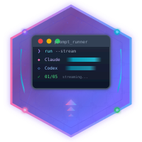

<p align="center">
  
</p>

<h1 align="center">Prompt Runner SDK</h1>

<p align="center">
  <strong>Packet-first prompt execution for Elixir, Mix, and local CLI workflows</strong>
</p>

<p align="center">
  <a href="https://github.com/nshkrdotcom/prompt_runner_sdk"></a>
  <a href="LICENSE"></a>
</p>

Prompt Runner SDK executes packetized prompt workflows against local
repositories. This README targets `prompt_runner_sdk ~> 0.12.0`.

For unattended or multi-operator packets, use an installed escript plus an
operator [workspace](guides/workspaces.md). Workspaces replace PID files,
supervisor shell loops, permission handoffs, shared builds, and verifier shell
pipelines with independent clones, durable state, structured contracts, and
systemd-user cgroup containment.

The packet-first design introduced in `0.7.0` carries forward unchanged:

- packets replace duplicated control files
- profiles replace ad hoc global defaults
- completion is verifier-owned, not provider-owned
- policy-driven retry, repair, and resume are built into the runtime
- a built-in simulated provider can prove recovery behavior without any
  external provider CLI

`0.12.0` adds agent-controlled movement through an ordinary linear prompt
sequence. An agent can continue, repeat the current prompt in a fresh session,
request verified early finish, or stop as blocked. The runner authenticates
each iteration-scoped request, retains deterministic ownership of successful
completion, rejects a premature finish with the unmet contract, and enforces a
per-prompt iteration cap. A failed provider launch never counts as a controlled
iteration even when the ordinary repository contract was already green. No
duplicated prompt slots, shell loop, process kill, or workflow graph is required.

See the [CHANGELOG](CHANGELOG.md) for the full list.

The same runtime is exposed through public Elixir modules and the CLI.

## Highlights

- one packet manifest: `prompt_runner_packet.md`
- one prompt format: `*.prompt.md` with YAML front matter
- template-based prompt scaffolding with home-scoped and packet-local templates
- home-scoped profiles under `~/.config/prompt_runner/`
- deterministic completion contracts plus generated checklist views
- a static authoring linter for the hazards that do not raise
- policy-driven retry, repair, and resume based on verifier state plus
  structured recovery envelopes
- agent-controlled `continue`, `repeat`, verified `finish`, and explicit
  `blocked` for linear prompt sequences
- cgroup-contained unattended runs with run-ID/lease/journal/progress health
- zero-dependency simulation for retry, repair, and resume demos
- public packet/profile/runtime APIs plus matching CLI commands
- Claude, Codex, Amp, Cursor, and Antigravity support through
  `agent_session_manager`
- no direct provider SDK dependencies required in host applications

## Installation

```elixir
def deps do
  [
    {:prompt_runner_sdk, "~> 0.12.0"}
  ]
end
```

```bash
mix deps.get
```

Prompt Runner is an explicit `agent_session_manager` core-lane client. Host
projects do not need `codex_sdk`, `claude_agent_sdk`, `amp_sdk`,
`cursor_cli_sdk`, or `antigravity_cli_sdk` just to use Prompt Runner.

`gemini_cli_sdk` is retired. Antigravity is the Google coding-agent provider;
`gemini_ex` remains a separate model API SDK and is not a Prompt Runner coding
agent provider.

For recovery demos and onboarding, Prompt Runner also ships a built-in
`simulated` provider that requires no external CLI or API credentials.
That provider is package-local support for retry, repair, and resume behavior;
cross-stack service-mode proofs should use configured ASM and
`cli_subprocess_core` runtime profiles instead of treating `:simulated` as an
end-to-end provider substitute.

## Quick Start

Initialize Prompt Runner once per machine:

```bash
mix prompt_runner init
mix prompt_runner template list
```

That creates:

- `codex-default` and `simulated-default` profiles under
  `~/.config/prompt_runner/profiles/`
- editable prompt templates under `~/.config/prompt_runner/templates/`

Start with the simulated path first. It is the shortest way to learn the packet
model and authoring workflow.

Create a simulated packet with repos and a default prompt template in one
command:

```bash
mix prompt_runner packet new demo \
  --profile simulated-default \
  --provider simulated \
  --model simulated-demo \
  --repo app=/path/to/repo \
  --default-repo app \
  --prompt-template from-adr
```

Create a prompt from that template:

```bash
mix prompt_runner prompt new 01 \
  --packet demo \
  --phase 1 \
  --name "Capture runtime boundaries" \
  --targets app \
  --commit "docs: add runtime boundaries summary"
```

If you want a real provider packet after that, switch the packet to a real
profile/provider/model or start with `codex-default`.

The generated prompt is template-based. Finish it by writing the source
material into the body and adding a deterministic `verify:` contract:

```markdown
---
id: "01"
phase: 1
name: "Capture runtime boundaries"
template: "from-adr"
targets:
  - "app"
commit: "docs: add runtime boundaries summary"
verify:
  files_exist:
    - "RUNTIME_BOUNDARIES.md"
  contains:
    - path: "RUNTIME_BOUNDARIES.md"
      text: "Prompt Runner owns packet orchestration."
  commands:
    - exec: "test"
      args: ["-s", "RUNTIME_BOUNDARIES.md"]
      timeout_ms: 60000
  changed_paths_only:
    - "RUNTIME_BOUNDARIES.md"
---
# Capture runtime boundaries

## Required Reading

- `docs/adr-001-runtime-boundaries.md`

## Mission

Read ADR 001 and create `RUNTIME_BOUNDARIES.md` in the target repo.

## Deliverables

- `RUNTIME_BOUNDARIES.md` summarizing the runtime boundary split

## Non-Goals

Do not modify any other files. Respond with exactly `ok`.
```

Required reading belongs in the body: only the markdown after the front matter
reaches the model. Verification commands use bounded structured argv: the
verifier executes `exec` plus `args` directly, inherits the runner environment,
does not reload login profiles, and enforces `timeout_ms`.

Turn the verification contract into a human checklist and check the packet:

```bash
mix prompt_runner checklist sync demo
mix prompt_runner packet lint demo
mix prompt_runner packet doctor demo
mix prompt_runner packet preflight demo
```

Inspect, run, and check status:

```bash
mix prompt_runner list demo
mix prompt_runner plan demo
mix prompt_runner run demo --dry-run
mix prompt_runner run demo
mix prompt_runner status demo
```

Packet-local runtime state is written to `demo/.prompt_runner/`.

For a long run, supervise it from a second pane:

```bash
mix prompt_runner watch demo
# WATCH 16:57Z runner=UP prompt=11 quiet=0min repos=1 dirty=0 commits=27
```

For a ready-made authoring walkthrough from ADRs/docs to finished prompts, see
[`examples/authoring_packet/`](examples/authoring_packet/README.md).

## Packet Model

A packet directory is the primary unit of work:

```text
demo/
  prompt_runner_packet.md
  templates/
    from-adr.prompt.md
  docs/
    adr-001-runtime-boundaries.md
  prompts/
    01_capture_runtime_boundaries.prompt.md
    01_capture_runtime_boundaries.prompt.checklist.md
  .prompt_runner/
    state.json
    progress.log
    logs/
```

Core files:

- `prompt_runner_packet.md`
  packet-level repos, defaults, and phase names
- `templates/*.prompt.md`
  reusable prompt scaffold templates
- `docs/`
  packet-local source material such as ADRs and design docs
- `*.prompt.md`
  one prompt per file
- `*.prompt.checklist.md`
  generated human view of the deterministic verification contract
- `.prompt_runner/state.json`
  packet-local attempt and verifier history

## Programmatic API

The CLI is a thin layer over public modules:

```elixir
{:ok, _paths} = PromptRunner.Profile.init()
{:ok, packet} = PromptRunner.Packet.new("demo", root: "/tmp")
{:ok, packet} = PromptRunner.Packet.add_repo(packet.root, "app", "/path/to/repo", default: true)

{:ok, _prompt_path} =
  PromptRunner.Packets.create_prompt(packet.root, %{
    "id" => "01",
    "phase" => 1,
    "name" => "Create hello file",
    "targets" => ["app"],
    "commit" => "docs: add hello file"
  })

{:ok, plan} = PromptRunner.plan(packet.root, interface: :cli)
{:ok, run} = PromptRunner.run(packet.root, interface: :cli)
{:ok, status} = PromptRunner.status(packet.root)
```

For embedded use, `PromptRunner.run/2` defaults to an in-memory runtime store
plus a no-op committer:

```elixir
{:ok, run} =
  PromptRunner.run("/path/to/packet",
    provider: :codex,
    model: "gpt-5.6-luna",
    committer: :noop,
    runtime_store: :memory
  )
```

## Verification, Retry, and Repair

Prompt Runner no longer equates provider success with completion.

Each prompt can declare a deterministic completion contract:

| Clause | Asserts |
|--------|---------|
| `files_exist` / `files_absent` | the path is there, or is not |
| `contains` / `matches` | file content, literally or by regex |
| `doc` | the document is non-blank, includes required sections, and has no unresolved markers |
| `yaml` / `json` | structured data parses and satisfies path assertions |
| `glob` / `source_absent` | artifact sets and forbidden source patterns |
| `commands` | a bounded structured argv exits zero and satisfies output assertions |
| `changed_paths_only` | nothing changed outside an allowed set |
| `repos_clean` | the repository is committed, and optionally pushed |

After every attempt, the runner verifies the contract:

- verifier pass: prompt completes
- verifier fail after provider success: synthesize a repair prompt, while the
  repair budget lasts
- verifier fail with the repair budget spent: fail, naming the unmet items
- provider failure plus verifier pass: complete unless the failure is a local
  deterministic contradiction
- remote/provider-claimed auth, config, model-unavailable, capacity, and
  generic runtime failures get bounded retries by policy
- provider failure plus partial workspace progress pivots into repair
- terminal policy/config failure: fail honestly even if files happen to exist

Generate checklist views from the contract:

```bash
mix prompt_runner checklist sync demo
```

The checklist is derived output for humans. The verifier report in
`.prompt_runner/state.json` remains the actual completion source of truth.

`mix prompt_runner packet doctor` flags common authoring gaps before a packet
run:

- no prompts
- no default repo
- prompt has no targets
- prompt has no verification items
- prompt still contains scaffold placeholder markers

`mix prompt_runner packet lint` flags authoring *hazards* — constructs that
load, run, and produce a wrong answer without raising:

- a prompt id that does not match its filename's numeric prefix, when ordering
  comes from the filename
- duplicate prompt ids, an unknown repo in `targets:` or a verify entry, or
  legacy `@group` syntax that expands to nothing in a packet
- a verify command with no `timeout`, when the verifier has none of its own
- a contract with no `commands:` entry, when `files_exist` is satisfied by an
  empty file
- `changed_paths_only`, which only sees uncommitted work and so passes
  vacuously in any packet where the session commits for itself
- `references`, `required_reading`, and `context_files`, which are parsed,
  stored, and never sent to the provider

`depends_on` is executable scheduler input: dependencies are validated and
topologically ordered, and a failed dependency blocks only its descendants
under the `continue_independent` workspace policy.

`--strict` promotes warnings to errors; `--json` emits a machine-readable
report.

`mix prompt_runner packet preflight` is the machine-readable runtime readiness
gate. It checks packet-local repo paths and git readiness, prints JSON, exits
`0` when runtime-ready, and exits non-zero when the provider run should not
start yet. CLI `run` calls packet preflight before invoking a provider; pass
`--skip-preflight` only when you intentionally want the run path to handle
packet readiness failures itself. Setup remains explicit: if a packet documents
a setup command such as `bash examples/.../setup.sh`, run it before preflight.

## Supervision

A long unattended run needs a way to tell "alive and thinking" from "hung", and
the obvious implementations of that check fail silently in the direction of
"healthy". `mix prompt_runner watch` avoids both traps:

- liveness comes from `.prompt_runner/run.pid`, which the runner writes for the
  duration of a run and removes on exit. A process-name match would also match
  the supervisor's own shell and report a live run forever.
- quiet time comes from file mtimes, not from parsing the JSONL event log,
  whose schema differs between `events_mode: compact` and `full`.

```bash
mix prompt_runner watch demo --interval 900
# WATCH 16:57Z runner=UP prompt=11 quiet=0min repos=3 dirty=0 commits=27
```

See [Supervising A Long Run](guides/supervision.md).

## CLI Entry Points

Use any of these:

- `mix prompt_runner ...`
- `mix run run_prompts.exs -- ...`
- `prompt_runner ...` after `mix escript.build`

## Examples

- [examples/README.md](examples/README.md)
- [examples/authoring_packet/README.md](examples/authoring_packet/README.md)
- [examples/simulated_recovery_packet/README.md](examples/simulated_recovery_packet/README.md)
- [examples/single_repo_packet/README.md](examples/single_repo_packet/README.md)
- [examples/multi_repo_packet/README.md](examples/multi_repo_packet/README.md)

## Documentation

- [Getting Started](guides/getting-started.md)
- [From ADRs To Packets](guides/from-adrs-to-packets.md)
- [CLI Guide](guides/cli.md)
- [API Guide](guides/api.md)
- [Packet Manifest Reference](guides/configuration.md)
- [Templates](guides/templates.md)
- [Profiles](guides/profiles.md)
- [Provider Guide](guides/providers.md)
- [Simulated Provider](guides/simulated-provider.md)
- [Verification And Repair](guides/verification-and-repair.md)
- [Packet Linting](guides/linting.md)
- [Supervising A Long Run](guides/supervision.md)
- [Agent-Controlled Linear Runs](guides/agent-control.md)
- [Multi-Repository Packets](guides/multi-repo.md)
- [Rendering Modes](guides/rendering.md)
- [Architecture](guides/architecture.md)

## Development

```bash
mix format --check-formatted
mix compile --force --warnings-as-errors
mix test
mix credo --strict
mix dialyzer
mix docs
```

### Dependency Sources

`agent_session_manager` and `cli_subprocess_core` resolve through the shared
`build_support/dependency_sources.exs` helper, the same one vendored by the
other repositories in this stack. Sibling checkouts win automatically when
they exist next to this repository, then GitHub, then Hex:

```bash
mix deps.sources
# dependency sources:
#   agent_session_manager -> path (../agent_session_manager) -> 0.15.0
#   cli_subprocess_core -> path (../cli_subprocess_core) -> 0.7.0
```

To resolve against the published releases instead — which is what you want
before packaging, and what CI sees — create a local, gitignored override:

```elixir
# .dependency_sources.local.exs
%{
  deps: %{
    agent_session_manager: %{source: :hex},
    cli_subprocess_core: %{source: :hex}
  }
}
```

```bash
mix deps.get
mix test
mix hex.build
```

Packaging tasks (`hex.build`, `hex.publish`, `hex.package`) always resolve Hex
sources regardless of the override, so package metadata stays Hex-clean. Note
that the two modes share `deps/` and `mix.lock`, so re-run `mix deps.get`
after switching. Delete the override file to return to sibling checkouts.

## License

MIT
